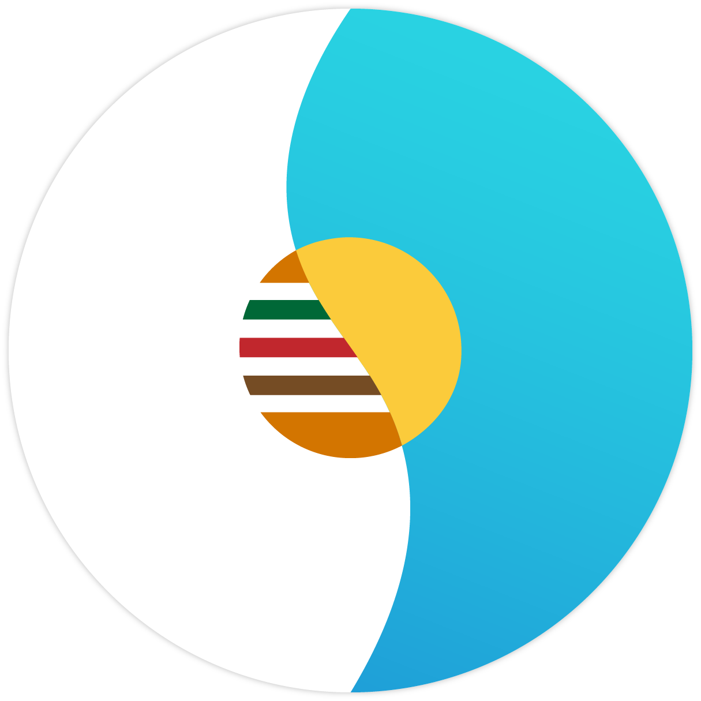
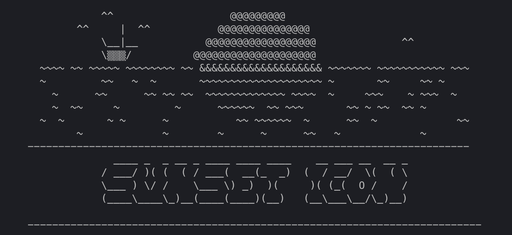

<h1 align="center"> <b>Sunset Icon</b> </h1>  

  

 

A simple site to upload images with javascript addon on illustrator and download free icon created with <b>Rocket</b> and <b>VueJS</b> (Rust & Javascript)

 

  

 